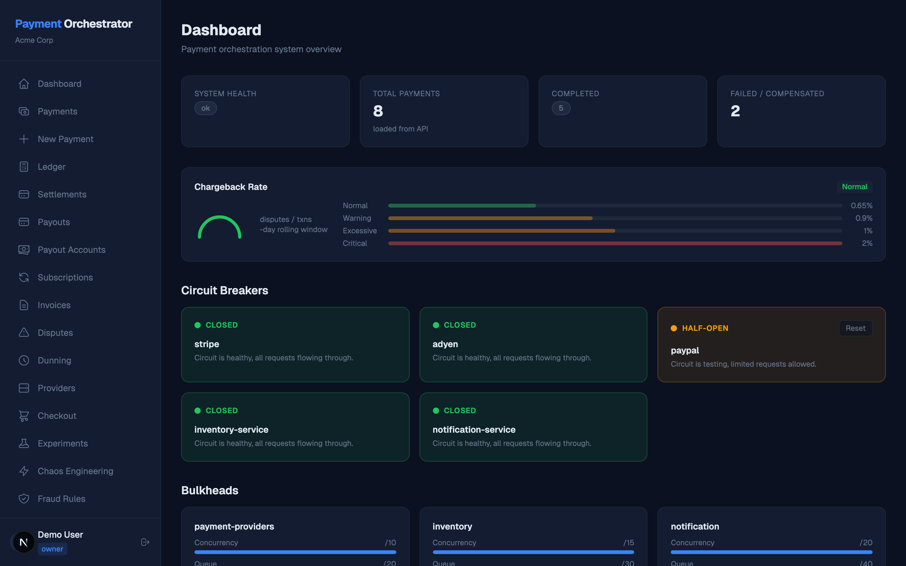
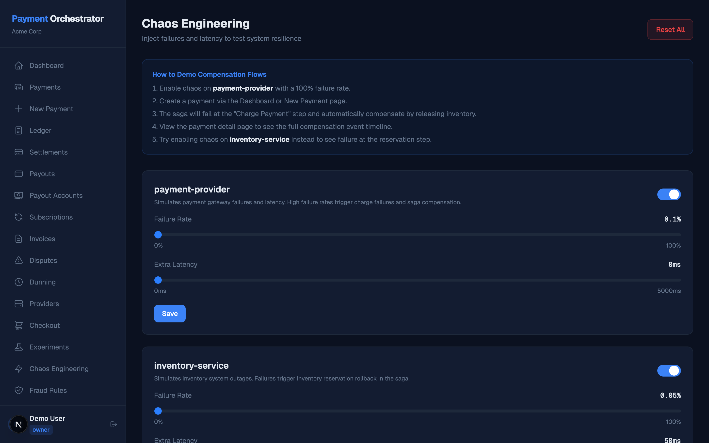
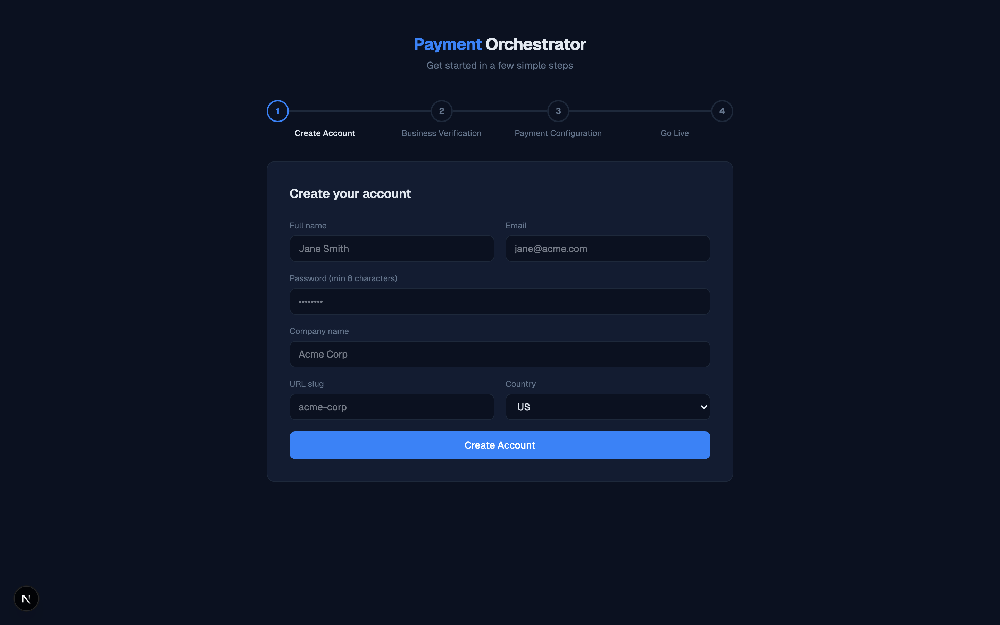
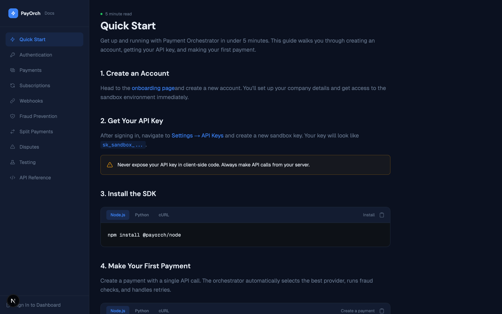
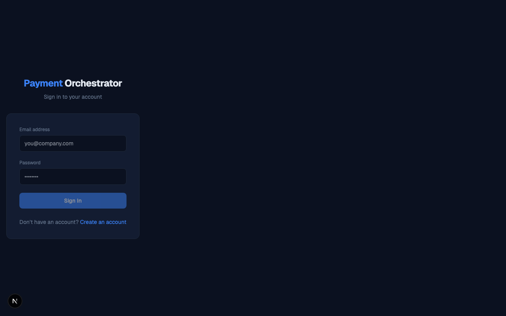
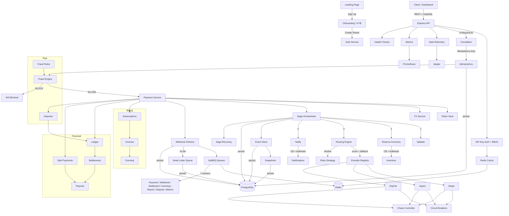

# Payment Orchestrator

A production-grade payment processing platform with multi-provider routing, saga orchestration, event sourcing, fraud scoring, subscription billing, and a full-stack dashboard.

[](https://github.com/JamilAfouri99/payment-orchestrator/actions/workflows/ci.yml)
[](https://www.typescriptlang.org/)
[](https://github.com/JamilAfouri99/payment-orchestrator)
[](LICENSE)



---

## Quick Start

```bash
git clone https://github.com/JamilAfouri99/payment-orchestrator.git
cd payment-orchestrator

# One command to start everything
./scripts/dev.sh
```

This starts PostgreSQL, Redis, runs migrations, seeds a demo account, boots the API server and dashboard.

| Service | URL |
|---------|-----|
| Dashboard | http://localhost:3001 |
| API | http://localhost:3000 |
| GraphQL Playground | http://localhost:3000/graphql |

**Demo credentials:** `demo@acme.com` / `demo1234`

### First API Call

```bash
curl -X POST http://localhost:3000/payments \
  -H "Content-Type: application/json" \
  -H "Idempotency-Key: my-first-payment" \
  -d '{"amount":4999,"currency":"USD","customerId":"cus_001","orderId":"ord_001","items":[{"productId":"prod_1","name":"Widget","quantity":1,"pricePerUnit":4999}],"region":"US"}'
```

---

## What This Is

A full payment orchestration SaaS platform — not a tutorial project. It handles multi-provider routing with scoring-based failover, saga-orchestrated transaction flows with automatic compensation, event-sourced audit trails, fraud prevention, subscription billing, marketplace split payments, and a 28-page operational dashboard. Built across 10 development phases covering everything from core payment processing to multi-tenant SaaS infrastructure.

---

## Features

### Core Payments

- **Multi-provider routing** — Scores Stripe, Adyen, and PayPal by health (40%), success rate (30%), cost (20%), and region (10%). Automatic failover in milliseconds.
- **Saga orchestration** — 4-step payment flow (validate, reserve inventory, charge, notify) with automatic reverse-order compensation on failure.
- **Event sourcing** — 28 event types in an append-only store. Reconstruct state at any past moment with temporal queries.
- **Idempotency** — Request deduplication via `Idempotency-Key` header prevents double charges.

| Payments List | Create Payment |
|:---:|:---:|
|  |  |

### Financial Infrastructure

- **Double-entry ledger** — Balanced debit/credit entries for every money movement.
- **Settlement calculation** — Daily batch settlement with per-merchant accounting.
- **Payout management** — Configurable schedules, hold periods, and minimum thresholds.
- **Multi-currency FX** — Real-time conversion with configurable spread across 8 currency pairs.

| Ledger | Settlements |
|:---:|:---:|
|  |  |

### Billing

- **Subscription management** — Plan-based recurring billing with trials, pausing, and cancellation.
- **Invoice generation** — Automatic invoicing with line items, tax calculation, and status tracking.
- **Dunning** — Configurable retry schedules for failed subscription payments with grace periods.

### Risk & Fraud

- **Fraud scoring engine** — 5 configurable rules with weighted scoring. Blocks payments above threshold before any charge.
- **Dispute management** — Full lifecycle tracking with evidence submission.

| Fraud Rules | Chaos Engineering |
|:---:|:---:|
|  |  |

### Platform

- **Multi-tenant architecture** — Full tenant isolation with per-tenant data scoping.
- **API key management** — Environment-scoped keys (sandbox/production) with granular permissions.
- **Role-based access control** — Owner, admin, developer, viewer roles with endpoint-level enforcement.
- **Merchant onboarding** — KYB workflow with company details, tax info, and representative verification.

| Onboarding | API Documentation |
|:---:|:---:|
|  |  |

### Observability & Infrastructure

- **OpenTelemetry tracing** — Distributed tracing with Jaeger for end-to-end request visibility.
- **BullMQ job queues** — 7 named queues with configurable concurrency and rate limiting.
- **Circuit breakers** — Per-provider three-state protection with exponential backoff and jitter.
- **Chaos engineering** — Runtime failure injection per provider/service for resilience testing.

| Metrics | Queues | Logs |
|:---:|:---:|:---:|
|  |  |  |

### Developer Tools

- **Sandbox** — Test cards for success, decline, 3DS, and error scenarios.
- **Webhook delivery** — HMAC-SHA256 signed events with automatic retry and dead-letter queue.
- **GraphQL API** — Queries, mutations, and subscriptions alongside REST endpoints.

| Sandbox | Webhooks | Idempotency Demo |
|:---:|:---:|:---:|
|  |  |  |

---

## Architecture



---

## Engineering Decisions

### Double-Entry Ledger Over Balance Columns

A balance column tells you the merchant has $1,234.56 but can't explain how they got there. Double-entry accounting creates paired debit/credit entries for every money movement, so the ledger is always internally consistent and auditable. For a payment platform handling other people's money, audit trails aren't optional.

### Event Sourcing for Payment State

When a customer calls support and asks "what happened to my payment?", a CRUD system shows the current row. Event sourcing shows: initiated at 10:30:01, fraud score 12 (ALLOW) at 10:30:02, routed to Stripe at 10:30:03, Stripe declined at 10:30:04, rerouted to Adyen at 10:30:05, charged at 10:30:06, completed at 10:30:07. Temporal queries reconstruct state at any past moment. The cost is query complexity, which snapshots solve.

### Weighted Routing Over Round-Robin

Round-robin treats all providers equally. They aren't. Stripe has 99.5% success in the US but 97% in APAC; Adyen has the opposite. The routing engine scores providers by circuit breaker health (40%), success rate (30%), cost (20%), and region match (10%). When a provider's success rate drops, it naturally receives less traffic. When its circuit breaker opens, traffic cascades to the next best option with zero manual intervention.

### Saga Orchestration Over 2PC

Two-phase commit requires all participants to hold locks simultaneously. In a payment system with external providers, this is impossible — each provider is independent. Saga orchestration handles partial failures gracefully: if the provider charged but notification failed, the orchestrator knows exactly which steps to reverse and in what order. State is persisted at every step, so even process crashes are recoverable.

---

## API Endpoints

### Public

| Method | Path | Description |
|--------|------|-------------|
| `GET` | `/health` | Liveness check |
| `GET` | `/health/ready` | Readiness check (DB, Redis, providers, queues) |
| `POST` | `/payments` | Create a payment (requires `Idempotency-Key`) |
| `GET` | `/payments` | List payments (paginated) |
| `GET` | `/payments/:id` | Current payment state |
| `GET` | `/payments/:id/events` | Full event history |
| `GET` | `/payments/:id/state?at=` | Temporal query |
| `POST` | `/payments/:id/replay` | Rebuild state from events |
| `POST` | `/webhooks/register` | Register callback URL |
| `GET` | `/webhooks/registrations` | List registrations |
| `GET` | `/webhooks/deliveries` | Delivery history |
| `GET` | `/webhooks/dlq` | Dead-letter queue |
| `POST` | `/webhooks/dlq/:id/retry` | Retry DLQ entry |

### Auth

| Method | Path | Description |
|--------|------|-------------|
| `POST` | `/auth/register` | Create tenant + user |
| `POST` | `/auth/login` | Authenticate |
| `GET` | `/auth/me` | Current user and tenant |

### Admin

| Method | Path | Description |
|--------|------|-------------|
| `GET/POST` | `/admin/chaos` | Chaos configuration |
| `GET` | `/admin/circuit-breakers` | Circuit breaker states |
| `GET` | `/admin/providers` | Provider config + health |
| `GET/POST` | `/admin/fraud/rules` | Fraud rule CRUD |
| `POST` | `/admin/fraud/simulate` | Fraud scoring simulator |
| `GET` | `/admin/metrics` | Counters + histograms |
| `GET` | `/admin/logs` | Structured logs |
| `GET` | `/admin/bulkheads` | Concurrency stats |
| `GET` | `/admin/queues` | Queue stats |
| `GET/POST` | `/admin/fx/rates` | FX rates |
| `GET` | `/tokens` | Payment tokens |

### GraphQL — `/graphql`

**Queries**: payment, payments, paymentEvents, providers, fraudRules, fxRates, declineCodes, metrics
**Mutations**: createPayment, registerWebhook, upsertFraudRule, deleteFraudRule, updateChaos, revokeToken, updateFxRate
**Subscriptions**: paymentStatusChanged

---

## Tech Stack

| Layer | Technology |
|-------|-----------|
| Runtime | Node.js 22 LTS, TypeScript 5.7 (strict mode, ESM) |
| API | Express 4, RFC 7807 error responses |
| GraphQL | graphql-yoga with subscriptions |
| Database | PostgreSQL 16 via Prisma ORM (38 models, 10 migrations) |
| Cache | Redis 7 via ioredis |
| Queues | BullMQ (7 named queues) |
| Tracing | OpenTelemetry with Jaeger |
| Dashboard | Next.js 16, React 19, Tailwind CSS v4 |
| Testing | Vitest (640 tests across 44 files) |
| CI/CD | GitHub Actions (lint, typecheck, test, Docker build) |

---

## Testing

**640 tests** across **44 test files**, all passing.

```bash
npm test                            # Run all tests
npx tsc --noEmit                    # Type check backend
cd dashboard && npx tsc --noEmit    # Type check frontend
```

---

## Project Structure

```
src/
├── main.ts                                 Entry point — wires everything
│
├── core/                                   Shared foundation
│   ├── config.ts                           Env vars + production validation
│   ├── database.ts                         Prisma client init
│   ├── logger.ts                           Structured logging
│   ├── correlation.ts                      X-Request-ID middleware
│   ├── result.ts                           Result<T, E> discriminated union
│   └── types.ts                            PaymentRequest, PaymentState, DomainEvent
│
├── api/                                    HTTP layer
│   ├── routes.ts                           Public endpoints (/payments, /health, /webhooks)
│   ├── auth-routes.ts                      Auth endpoints (/auth/register, /login, /me)
│   ├── admin-routes.ts                     Thin composer — delegates to admin/*
│   ├── route-helpers.ts                    respondProblem, respondFromError, getTenantId
│   ├── payment-service.ts                  PaymentService interface + factory composer
│   ├── payment-initiation.ts               initiatePayment flow + fraud context builder
│   ├── payment-queries.ts                  getPayment, listPayments, replay, events
│   ├── tenant-services.ts                  Per-tenant service cache + factory
│   └── admin/                              24 domain-specific sub-routers
│       ├── chaos-routes.ts                 Chaos engineering config
│       ├── circuit-breaker-routes.ts       Circuit breaker state + reset
│       ├── observability-routes.ts         Metrics, logs, bulkheads
│       ├── provider-routes.ts              Provider config + routing simulate
│       ├── fraud-routes.ts                 Fraud rule CRUD + simulate
│       ├── token-routes.ts                 Payment token management
│       ├── fx-routes.ts                    FX rate management
│       ├── ledger-routes.ts                Ledger accounts + transactions
│       ├── settlement-routes.ts            Settlement lifecycle
│       ├── plan-routes.ts                  Subscription plan CRUD
│       ├── subscription-routes.ts          Subscription lifecycle
│       ├── billing-routes.ts               Invoices + dunning
│       ├── dispute-routes.ts               Dispute lifecycle + evidence
│       ├── payout-routes.ts                Payout processing
│       ├── payout-account-routes.ts        Payout account setup
│       ├── split-payment-routes.ts         Split payment management
│       ├── analytics-routes.ts             Metrics + timeseries
│       ├── report-routes.ts                Financial reports
│       ├── experiment-routes.ts            A/B test management
│       ├── checkout-routes.ts              Checkout sessions
│       ├── three-d-secure-routes.ts        3DS challenge flow
│       ├── sandbox-routes.ts               Test cards + payment methods
│       ├── queue-routes.ts                 BullMQ queue management
│       └── webhook-routes.ts               Verify, catalog, saga recovery
│
├── middleware/                             Express middleware
│   ├── error-handler.ts                    RFC 7807 catch-all
│   └── request-logger.ts                   Request timing
│
├── auth/                                   Authentication & authorization
│   ├── session-service.ts                  JWT register/login/verify
│   ├── api-key-service.ts                  API key generate/validate/revoke
│   ├── api-key-middleware.ts               Express auth gate
│   ├── password.ts                         bcrypt hash/verify
│   ├── permissions.ts                      RBAC enforcement
│   ├── onboarding-service.ts               KYB workflow
│   └── team-service.ts                     Team invites + member management
│
├── tenancy/                                Multi-tenant isolation
│   ├── tenant-context.ts                   Request-scoped tenant context
│   └── tenant-service.ts                   Tenant + merchant account CRUD
│
├── events/                                 Event sourcing
│   ├── event-store.ts                      Append-only store, optimistic locking
│   ├── snapshot-store.ts                   Snapshot optimization
│   └── payment-projection.ts              28-event-type reducer
│
├── saga/                                   Saga orchestration
│   ├── saga-orchestrator.ts                State machine + compensation
│   ├── payment-saga.ts                     4-step saga (validate→reserve→charge→notify)
│   └── saga-recovery.ts                    Crash recovery scan
│
├── routing/                                Provider routing
│   ├── provider-registry.ts                Provider registration + eligibility
│   ├── routing-engine.ts                   Weighted scoring + cascading fallback
│   └── provider-metrics.ts                 Per-provider success rate, latency
│
├── retry/                                  Decline handling
│   ├── decline-codes.ts                    13 codes → hard/soft/retriable
│   └── retry-strategy.ts                   Retry action + backoff
│
├── fraud/                                  Fraud prevention
│   ├── fraud-engine.ts                     Rule-based scoring engine
│   └── seed-rules.ts                       5 default fraud rules
│
├── tokenization/                           PCI tokenization
│   ├── token-vault.ts                      tok_ prefixed secure tokens
│   └── card-masker.ts                      PAN redaction
│
├── fx/                                     Foreign exchange
│   └── fx-service.ts                       Multi-currency conversion
│
├── circuit-breaker/                        Resilience
│   ├── circuit-breaker.ts                  Three-state breaker
│   └── circuit-breaker-registry.ts         Registry of 5 breakers
│
├── bulkhead/                               Concurrency isolation
│   └── bulkhead.ts
│
├── chaos/                                  Chaos engineering
│   └── chaos-controller.ts                 Runtime failure injection
│
├── idempotency/                            Request deduplication
│   └── idempotency-middleware.ts
│
├── webhooks/                               Webhook delivery
│   ├── webhook-delivery.ts                 HMAC-SHA256 signed delivery + DLQ
│   └── webhook-scheduler.ts                5s retry scheduler
│
├── webhook-catalog/                        Event type definitions
│   └── webhook-catalog.ts
│
├── subscription/                           Recurring billing
│   └── subscription-service.ts
│
├── billing/                                Invoicing + dunning
│   ├── billing-engine.ts
│   └── dunning-service.ts
│
├── ledger/                                 Double-entry accounting
│   └── ledger-service.ts
│
├── settlement/                             Daily batch settlements
│   └── settlement-service.ts
│
├── payout/                                 Payout management
│   └── payout-service.ts
│
├── split/                                  Split payments
│   └── split-payment-service.ts
│
├── dispute/                                Chargeback lifecycle
│   └── dispute-service.ts
│
├── checkout/                               Checkout sessions
│   └── checkout-service.ts
│
├── three-d-secure/                         3DS challenge flow
│   └── three-d-secure-service.ts
│
├── analytics/                              Event aggregation
│   └── analytics-service.ts
│
├── reporting/                              Financial reports
│   └── report-service.ts
│
├── experiments/                            A/B testing
│   └── experiment-service.ts
│
├── sandbox/                                Test card sandbox
│   └── sandbox-service.ts
│
├── payment-methods/                        Payment method CRUD
│   └── payment-method-service.ts
│
├── cache/                                  Redis cache
│   └── cache-service.ts
│
├── queue/                                  BullMQ
│   ├── queue-service.ts
│   └── workers/                            7 background job workers
│       ├── payment-worker.ts
│       ├── webhook-worker.ts
│       ├── settlement-worker.ts
│       ├── dunning-worker.ts
│       ├── report-worker.ts
│       ├── dispute-worker.ts
│       └── metrics-worker.ts
│
├── health/                                 Health checks
│   ├── health-service.ts
│   └── prometheus.ts                       Prometheus exporter
│
├── metrics/                                In-memory metrics
│   └── metrics-collector.ts
│
├── observability/                          Tracing
│   ├── tracing.ts                          OpenTelemetry setup
│   └── span-helpers.ts
│
├── external-services/                      Provider stubs
│   ├── payment-provider.ts                 Base interface
│   ├── stripe-provider.ts
│   ├── adyen-provider.ts
│   ├── paypal-provider.ts
│   ├── inventory-service.ts
│   └── notification-service.ts
│
├── graphql/                                GraphQL API
│   ├── yoga-server.ts
│   ├── schema.ts
│   ├── resolvers.ts
│   └── subscriptions.ts
│
├── cli/                                    CLI client
│   └── cli-client.ts
│
└── docs/                                   API documentation
    ├── docs-routes.ts
    ├── openapi-spec.ts                     Thin composer (102 lines)
    └── schemas/                            10 domain schema modules
        ├── helpers.ts
        ├── common-schemas.ts
        ├── payment-schemas.ts
        ├── auth-schemas.ts
        ├── webhook-schemas.ts
        ├── fraud-schemas.ts
        ├── provider-schemas.ts
        ├── admin-schemas.ts
        ├── billing-schemas.ts
        └── financial-schemas.ts

dashboard/                                  Next.js 16 frontend
├── src/app/                                28+ pages (App Router, all client components)
│   ├── landing/                            Marketing landing page
│   ├── docs/                               10 documentation pages with code examples
│   ├── payments/                           Payment list, create, detail
│   ├── ledger/                             Double-entry ledger viewer
│   ├── settlements/                        Settlement batches
│   ├── subscriptions/                      Subscription management
│   ├── disputes/                           Dispute lifecycle
│   ├── fraud/                              Fraud rule configuration
│   ├── providers/                          Provider health + routing
│   ├── chaos/                              Chaos engineering controls
│   ├── webhooks/                           Webhook management
│   ├── metrics/                            Real-time metrics
│   ├── logs/                               Structured log viewer
│   ├── queues/                             BullMQ queue dashboard
│   ├── sandbox/                            Test card sandbox
│   ├── settings/                           API keys + team management
│   └── onboarding/                         KYB onboarding wizard
├── src/components/                         5 shared UI components
└── src/lib/                                API client + auth context

prisma/
├── schema.prisma                           38 models
├── seed.ts                                 Demo user + sample data
└── migrations/                             10 migrations

scripts/
└── dev.sh                                  One-command startup
```

---

## Architecture Decisions

This project follows a **modular monolith** architecture — a single deployable with strict module boundaries organized by business domain. This is the [recommended starting point for 2026](https://www.beyondthesemicolon.com/are-microservices-still-worth-it-in-2026-or-should-you-start-with-a-modular-monolith/) over premature microservices.

### Why Modular Monolith

- **Domain-based folders** over layer-based (no flat `controllers/`, `services/`, `models/` directories). Each domain (`fraud/`, `ledger/`, `saga/`) owns its service, types, and tests.
- **Factory functions** (`createXxxService(deps)`) for dependency injection without a DI container. Each module exports a typed interface and a factory — consumers depend on the interface, not the implementation.
- **Co-located tests** — test files sit next to source files (`fraud-engine.ts` + `fraud-engine.test.ts`). This makes coverage gaps immediately visible and keeps tests synchronized with implementation.
- **No barrel files** — direct named imports prevent circular dependency issues and make the dependency graph explicit.
- **Single database, module-scoped tables** — all 38 Prisma models live in one schema, but each module only queries its own tables. This avoids the operational overhead of per-service databases while maintaining logical separation.

### Why Not Microservices

Each domain module could be extracted into a separate service if needed — the boundaries are already clean. But for a single-team project, the operational overhead of distributed systems (service discovery, network serialization, distributed transactions, independent deployments) adds complexity without proportional benefit. The modular monolith gives us the same code isolation with simpler debugging, consistent transactions, and one deployment.

### Design Patterns

| Pattern | Where | Why |
|---------|-------|-----|
| **Factory + Interface** | Every service module | DI without a container; consumers depend on interfaces, not implementations |
| **Result\<T, E\>** | All business logic | Explicit error handling; business logic never throws |
| **Saga Orchestration** | `src/saga/` | Distributed transaction across providers with automatic compensation |
| **Event Sourcing** | `src/events/` | Full audit trail; temporal queries; state replay from any point |
| **Circuit Breaker** | `src/circuit-breaker/` | Fail-fast protection for external provider calls |
| **Bulkhead** | `src/bulkhead/` | Concurrency isolation prevents cascade failures |
| **Strategy** | `src/routing/` | Provider selection varies by health, cost, region — scoring weights are configurable |
| **Observer** | `src/webhooks/` + GraphQL subscriptions | Async event delivery to external systems |

---

## License

[MIT](LICENSE)
