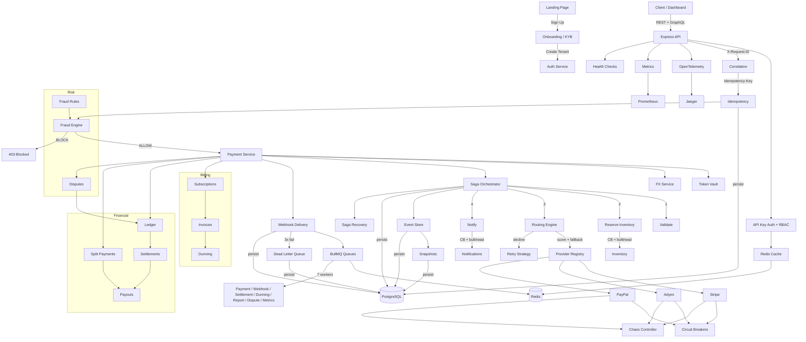

# Payment Orchestrator

A production-grade payment processing platform with multi-provider routing, saga orchestration, event sourcing, fraud scoring, subscription billing, and a full-stack dashboard.

[](https://github.com/JamilAfouri99/payment-orchestrator/actions/workflows/ci.yml)
[](https://www.typescriptlang.org/)
[](https://github.com/JamilAfouri99/payment-orchestrator)
[](LICENSE)


---

## Quick Start

```bash
git clone https://github.com/JamilAfouri99/payment-orchestrator.git
cd payment-orchestrator

# One command to start everything
./scripts/dev.sh
```

This starts PostgreSQL, Redis, runs migrations, seeds a demo account, boots the API server and dashboard.

| Service | URL |
|---------|-----|
| Dashboard | http://localhost:3001 |
| API | http://localhost:3000 |
| GraphQL Playground | http://localhost:3000/graphql |

**Demo credentials:** `demo@acme.com` / `demo1234`

### First API Call

```bash
curl -X POST http://localhost:3000/payments \
  -H "Content-Type: application/json" \
  -H "Idempotency-Key: my-first-payment" \
  -d '{"amount":4999,"currency":"USD","customerId":"cus_001","orderId":"ord_001","items":[{"productId":"prod_1","name":"Widget","quantity":1,"pricePerUnit":4999}],"region":"US"}'
```

---

## What This Is

A full payment orchestration SaaS platform — not a tutorial project. It handles multi-provider routing with scoring-based failover, saga-orchestrated transaction flows with automatic compensation, event-sourced audit trails, fraud prevention, subscription billing, marketplace split payments, and a 28-page operational dashboard. Built across 10 development phases covering everything from core payment processing to multi-tenant SaaS infrastructure.

---

## Features

### Core Payments

- **Multi-provider routing** — Scores Stripe, Adyen, and PayPal by health (40%), success rate (30%), cost (20%), and region (10%). Automatic failover in milliseconds.
- **Saga orchestration** — 4-step payment flow (validate, reserve inventory, charge, notify) with automatic reverse-order compensation on failure.
- **Event sourcing** — 28 event types in an append-only store. Reconstruct state at any past moment with temporal queries.
- **Idempotency** — Request deduplication via `Idempotency-Key` header prevents double charges.

| Payments List | Create Payment |
|:---:|:---:|
|  |  |

### Financial Infrastructure

- **Double-entry ledger** — Balanced debit/credit entries for every money movement.
- **Settlement calculation** — Daily batch settlement with per-merchant accounting.
- **Payout management** — Configurable schedules, hold periods, and minimum thresholds.
- **Multi-currency FX** — Real-time conversion with configurable spread across 8 currency pairs.

| Ledger | Settlements |
|:---:|:---:|
|  |  |

### Billing

- **Subscription management** — Plan-based recurring billing with trials, pausing, and cancellation.
- **Invoice generation** — Automatic invoicing with line items, tax calculation, and status tracking.
- **Dunning** — Configurable retry schedules for failed subscription payments with grace periods.

### Risk & Fraud

- **Fraud scoring engine** — 5 configurable rules with weighted scoring. Blocks payments above threshold before any charge.
- **Dispute management** — Full lifecycle tracking with evidence submission.

| Fraud Rules | Chaos Engineering |
|:---:|:---:|
|  |  |

### Platform

- **Multi-tenant architecture** — Full tenant isolation with per-tenant data scoping.
- **API key management** — Environment-scoped keys (sandbox/production) with granular permissions.
- **Role-based access control** — Owner, admin, developer, viewer roles with endpoint-level enforcement.
- **Merchant onboarding** — KYB workflow with company details, tax info, and representative verification.

| Onboarding | API Documentation |
|:---:|:---:|
|  |  |

### Observability & Infrastructure

- **OpenTelemetry tracing** — Distributed tracing with Jaeger for end-to-end request visibility.
- **BullMQ job queues** — 7 named queues with configurable concurrency and rate limiting.
- **Circuit breakers** — Per-provider three-state protection with exponential backoff and jitter.
- **Chaos engineering** — Runtime failure injection per provider/service for resilience testing.

| Metrics | Queues | Logs |
|:---:|:---:|:---:|
|  |  |  |

### Developer Tools

- **Sandbox** — Test cards for success, decline, 3DS, and error scenarios.
- **Webhook delivery** — HMAC-SHA256 signed events with automatic retry and dead-letter queue.
- **GraphQL API** — Queries, mutations, and subscriptions alongside REST endpoints.

| Sandbox | Webhooks | Idempotency Demo |
|:---:|:---:|:---:|
|  |  |  |

---

## Architecture



---

## Engineering Decisions

### Double-Entry Ledger Over Balance Columns

A balance column tells you the merchant has $1,234.56 but can't explain how they got there. Double-entry accounting creates paired debit/credit entries for every money movement, so the ledger is always internally consistent and auditable. For a payment platform handling other people's money, audit trails aren't optional.

### Event Sourcing for Payment State

When a customer calls support and asks "what happened to my payment?", a CRUD system shows the current row. Event sourcing shows: initiated at 10:30:01, fraud score 12 (ALLOW) at 10:30:02, routed to Stripe at 10:30:03, Stripe declined at 10:30:04, rerouted to Adyen at 10:30:05, charged at 10:30:06, completed at 10:30:07. Temporal queries reconstruct state at any past moment. The cost is query complexity, which snapshots solve.

### Weighted Routing Over Round-Robin

Round-robin treats all providers equally. They aren't. Stripe has 99.5% success in the US but 97% in APAC; Adyen has the opposite. The routing engine scores providers by circuit breaker health (40%), success rate (30%), cost (20%), and region match (10%). When a provider's success rate drops, it naturally receives less traffic. When its circuit breaker opens, traffic cascades to the next best option with zero manual intervention.

### Saga Orchestration Over 2PC

Two-phase commit requires all participants to hold locks simultaneously. In a payment system with external providers, this is impossible — each provider is independent. Saga orchestration handles partial failures gracefully: if the provider charged but notification failed, the orchestrator knows exactly which steps to reverse and in what order. State is persisted at every step, so even process crashes are recoverable.

---

## API Endpoints

### Public

| Method | Path | Description |
|--------|------|-------------|
| `GET` | `/health` | Liveness check |
| `GET` | `/health/ready` | Readiness check (DB, Redis, providers, queues) |
| `POST` | `/payments` | Create a payment (requires `Idempotency-Key`) |
| `GET` | `/payments` | List payments (paginated) |
| `GET` | `/payments/:id` | Current payment state |
| `GET` | `/payments/:id/events` | Full event history |
| `GET` | `/payments/:id/state?at=` | Temporal query |
| `POST` | `/payments/:id/replay` | Rebuild state from events |
| `POST` | `/webhooks/register` | Register callback URL |
| `GET` | `/webhooks/registrations` | List registrations |
| `GET` | `/webhooks/deliveries` | Delivery history |
| `GET` | `/webhooks/dlq` | Dead-letter queue |
| `POST` | `/webhooks/dlq/:id/retry` | Retry DLQ entry |

### Auth

| Method | Path | Description |
|--------|------|-------------|
| `POST` | `/auth/register` | Create tenant + user |
| `POST` | `/auth/login` | Authenticate |
| `GET` | `/auth/me` | Current user and tenant |

### Admin

| Method | Path | Description |
|--------|------|-------------|
| `GET/POST` | `/admin/chaos` | Chaos configuration |
| `GET` | `/admin/circuit-breakers` | Circuit breaker states |
| `GET` | `/admin/providers` | Provider config + health |
| `GET/POST` | `/admin/fraud/rules` | Fraud rule CRUD |
| `POST` | `/admin/fraud/simulate` | Fraud scoring simulator |
| `GET` | `/admin/metrics` | Counters + histograms |
| `GET` | `/admin/logs` | Structured logs |
| `GET` | `/admin/bulkheads` | Concurrency stats |
| `GET` | `/admin/queues` | Queue stats |
| `GET/POST` | `/admin/fx/rates` | FX rates |
| `GET` | `/tokens` | Payment tokens |

### GraphQL — `/graphql`

**Queries**: payment, payments, paymentEvents, providers, fraudRules, fxRates, declineCodes, metrics
**Mutations**: createPayment, registerWebhook, upsertFraudRule, deleteFraudRule, updateChaos, revokeToken, updateFxRate
**Subscriptions**: paymentStatusChanged

---

## Tech Stack

| Layer | Technology |
|-------|-----------|
| Runtime | Node.js 22 LTS, TypeScript 5.7 (strict mode, ESM) |
| API | Express 4, RFC 7807 error responses |
| GraphQL | graphql-yoga with subscriptions |
| Database | PostgreSQL 16 via Prisma ORM (38 models, 10 migrations) |
| Cache | Redis 7 via ioredis |
| Queues | BullMQ (7 named queues) |
| Tracing | OpenTelemetry with Jaeger |
| Dashboard | Next.js 16, React 19, Tailwind CSS v4 |
| Testing | Vitest (640 tests across 44 files) |
| CI/CD | GitHub Actions (lint, typecheck, test, Docker build) |

---

## Testing

**640 tests** across **44 test files**, all passing.

```bash
npm test                            # Run all tests
npx tsc --noEmit                    # Type check backend
cd dashboard && npx tsc --noEmit    # Type check frontend
```

---

## Project Structure

```
src/
  core/               Config, logger, result type, correlation IDs, database
  events/             Event store, snapshots, payment projection
  saga/               Saga orchestrator, payment saga steps, crash recovery
  routing/            Provider registry, routing engine, provider metrics
  retry/              Decline codes, retry strategy
  fraud/              Fraud engine, configurable rules, seed data
  tokenization/       Token vault, card masking (PCI)
  fx/                 FX rates, currency conversion
  circuit-breaker/    Per-provider breakers with registry pattern
  bulkhead/           Concurrency isolation
  chaos/              Runtime failure injection
  metrics/            In-memory counters and histograms
  idempotency/        Request deduplication middleware
  webhooks/           HMAC-signed delivery, DLQ, scheduler
  queue/              BullMQ service, 7 queue workers
  cache/              Redis cache with graceful degradation
  health/             Liveness, readiness, Prometheus exporter
  auth/               Sessions, API keys, RBAC, teams, onboarding, permissions
  tenancy/            Multi-tenant isolation and context
  subscription/       Recurring billing and plan management
  billing/            Invoice generation, dunning service
  ledger/             Double-entry accounting
  settlement/         Settlement calculation
  payout/             Payout management
  split/              Split payment processing
  dispute/            Chargeback handling
  checkout/           Checkout session management
  three-d-secure/     3DS challenge flow
  analytics/          Analytics tracking
  experiments/        A/B testing service
  sandbox/            API playground service
  external-services/  Stripe, Adyen, PayPal stubs + inventory + notification
  graphql/            Schema, resolvers, subscriptions
  observability/      OpenTelemetry tracing
  api/                Routes, admin routes, auth routes, payment service
  middleware/         Error handler, request logger
  main.ts             Entry point

dashboard/
  src/app/            28+ pages (Next.js App Router)
  src/app/landing/    Marketing landing page
  src/app/docs/       10 documentation pages with code examples
  src/components/     Shared UI components
  src/lib/            API client, auth context

prisma/               Schema (38 models), 10 migrations, seed script
scripts/              dev.sh (one-command startup)
```

---

## License

[MIT](LICENSE)
