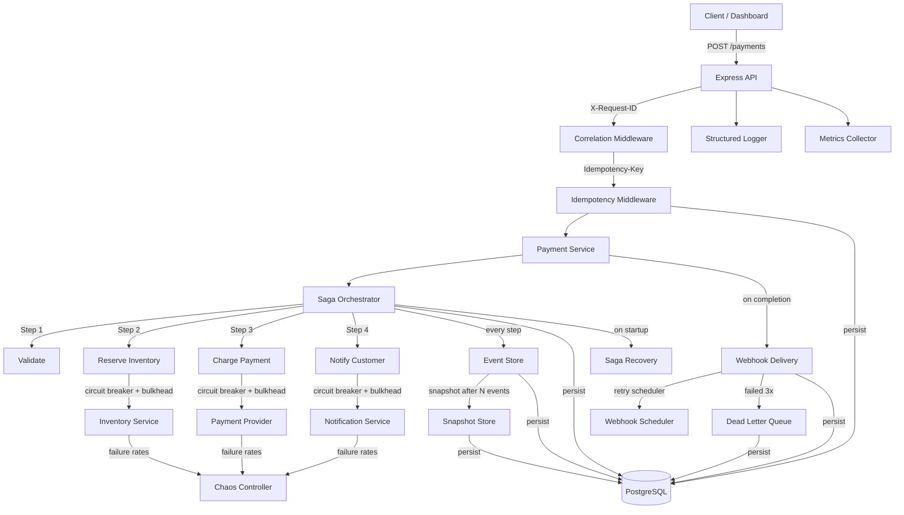
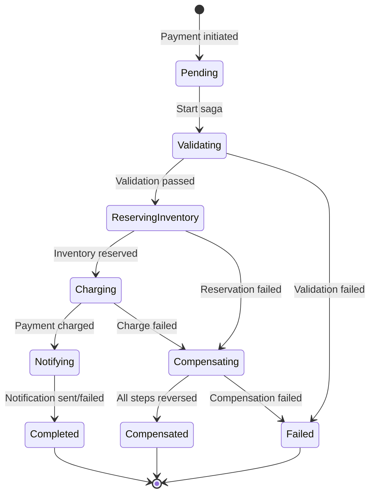
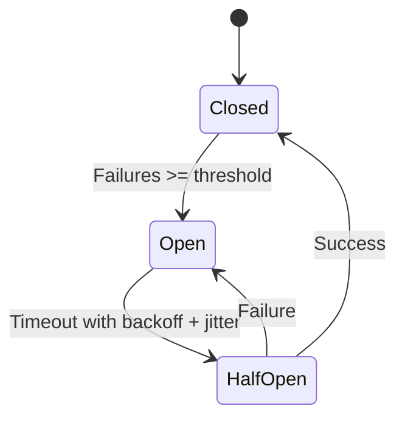

# Payment Orchestration System

A production-grade payment processing system demonstrating distributed systems patterns: saga orchestration with compensation, event sourcing with temporal queries, circuit breakers, bulkheads, idempotency, chaos engineering, webhook delivery with dead-letter queues, and structured observability. Includes a comprehensive Next.js dashboard for interactive demonstration.

## Quick Start

```bash
git clone https://github.com/JamilAfouri99/payment-orchestrator.git
cd payment-orchestrator

# Start the API + PostgreSQL
docker-compose up --build -d

# Start the dashboard (separate terminal)
cd dashboard && npm install && npm run dev
```

- **API**: http://localhost:3000
- **Dashboard**: http://localhost:3001

## Dashboard Pages

| Page | URL | What It Does |
|------|-----|-------------|
| **Dashboard** | `/` | System health, circuit breaker status, bulkhead utilization, quick payments, recent payments |
| **Payments** | `/payments` | Paginated payment history from the database with status badges |
| **New Payment** | `/payments/new` | Full payment form with dynamic line items and calculated totals |
| **Payment Detail** | `/payments/:id` | Saga flow visualization, event timeline, replay from events, temporal queries |
| **Chaos Engineering** | `/chaos` | Runtime failure injection per service (failure rate sliders, latency, enable/disable) |
| **Webhooks** | `/webhooks` | Registration, delivery history, dead-letter queue with retry buttons |
| **Metrics** | `/metrics` | Counters, histograms with percentiles (p50/p95/p99), auto-refresh |
| **Idempotency Demo** | `/idempotency` | Send + replay with same key, side-by-side comparison proving no double-processing |
| **Signature Verify** | `/verify` | HMAC-SHA256 verification playground with step-by-step explanation |
| **Logs** | `/logs` | Structured log stream with level filters, text search, expandable JSON details |

## Architecture



## Saga State Machine



## Circuit Breaker States



## Patterns Demonstrated

| Pattern | Description |
|---------|-------------|
| **Saga Orchestration** | Multi-step payment flow with automatic compensation on failure |
| **Event Sourcing** | All state derived by replaying append-only events, not mutable columns |
| **Temporal Queries** | Query payment state at any point in time by replaying events up to that moment |
| **Snapshot Optimization** | After N events, snapshots avoid replaying full history |
| **Idempotency** | Idempotency-Key header prevents duplicate processing with cached responses |
| **Circuit Breaker** | Three-state protection (closed/open/half-open) with exponential backoff and jitter |
| **Bulkhead** | Concurrency limiters prevent slow services from consuming all threads |
| **Chaos Engineering** | Runtime failure injection per service without restarts |
| **Webhook Delivery** | HMAC-SHA256 signed webhooks with retry scheduler and dead-letter queue |
| **DLQ Reprocessing** | Failed webhooks can be retried from the dead-letter queue |
| **Saga Recovery** | On startup, detects and handles sagas left in incomplete state from crashes |
| **Structured Logging** | JSON logs with correlation IDs, payment context, and in-memory buffer |
| **Result<T, E>** | Discriminated union replaces thrown exceptions in business logic |
| **Optimistic Locking** | Unique version constraints on event store prevent concurrent write conflicts |
| **RFC 7807** | All error responses follow Problem Details standard |
| **Correlation IDs** | X-Request-ID propagated through every request for distributed tracing |
| **Registry Pattern** | Circuit breakers managed through a central registry for monitoring and control |

## Why I Built This

Payment systems are where distributed systems patterns matter most. This project demonstrates understanding of:

1. **Sagas**: Distributed transactions across services can't use ACID. Saga compensation is the alternative, and it must survive process crashes.
2. **Event sourcing**: When someone asks "what happened to this payment?", replaying events gives the complete truth. Temporal queries let you see state at any past moment.
3. **Resilience**: Circuit breakers fail fast, bulkheads prevent cascade, chaos engineering proves the system handles degradation gracefully.
4. **Idempotency**: Networks are unreliable. Duplicate requests are inevitable. Idempotency keys make this safe.
5. **Observability**: Structured logging with correlation IDs, request metrics with percentiles, and a centralized admin API make the system debuggable.
6. **Webhooks**: HMAC-SHA256 signatures, retry with backoff, and dead-letter queues with reprocessing handle the full lifecycle of async event delivery.

## API Endpoints

### Public

| Method | Path | Description |
|--------|------|-------------|
| `GET` | `/health` | Database connectivity check |
| `GET` | `/payments` | List payments with pagination |
| `POST` | `/payments` | Start a payment saga (requires `Idempotency-Key`) |
| `GET` | `/payments/:id` | Current state derived from event replay |
| `GET` | `/payments/:id/events` | Full event history |
| `GET` | `/payments/:id/state?at=` | Temporal query: state at a point in time |
| `POST` | `/payments/:id/replay` | Rebuild state from events (bypasses snapshot) |
| `POST` | `/webhooks/register` | Register a callback URL |
| `GET` | `/webhooks/registrations` | List all webhook registrations |
| `GET` | `/webhooks/deliveries` | Delivery history with status |
| `GET` | `/webhooks/dlq` | Dead-letter queue contents |
| `POST` | `/webhooks/dlq/:id/retry` | Retry a DLQ entry |
| `POST` | `/webhooks/verify` | HMAC-SHA256 signature verification |

### Admin

| Method | Path | Description |
|--------|------|-------------|
| `GET` | `/admin/chaos` | Current chaos configuration |
| `POST` | `/admin/chaos` | Update failure rate/latency per service |
| `POST` | `/admin/chaos/reset` | Reset to initial config |
| `GET` | `/admin/circuit-breakers` | State of all circuit breakers |
| `POST` | `/admin/circuit-breakers/:name/reset` | Reset a specific breaker |
| `GET` | `/admin/metrics` | Counters and histograms |
| `GET` | `/admin/logs` | Recent structured log entries |
| `GET` | `/admin/bulkheads` | Bulkhead concurrency stats |
| `POST` | `/admin/saga-recovery` | Trigger saga recovery scan |

## Tech Stack

- **Runtime**: Node.js 20+ with TypeScript (strict mode, ESM)
- **Database**: PostgreSQL 16 via Prisma ORM
- **API**: Express with RFC 7807 error responses
- **Dashboard**: Next.js 16, Tailwind CSS, App Router
- **Testing**: Vitest (49 unit tests)
- **Infrastructure**: Docker + docker-compose

## Project Structure

```
src/
  core/               Result type, types, config, database, logger, correlation IDs
  events/             Event store (temporal queries, snapshots), payment projection
  saga/               Saga orchestrator, payment saga steps, startup recovery
  circuit-breaker/    Circuit breaker, registry pattern
  bulkhead/           Concurrency limiter
  chaos/              Runtime failure injection controller
  metrics/            In-memory counters and histograms
  idempotency/        Idempotency middleware
  webhooks/           Webhook delivery, HMAC signing, DLQ, retry scheduler
  external-services/  Stubbed services driven by chaos controller
  api/                Payment service, routes, admin routes
  middleware/         Error handler, request logger
  main.ts             Application entry point

dashboard/
  src/app/            10 pages (App Router)
  src/components/     Shared UI components
  src/lib/            API client with 18+ fetch functions

prisma/               Schema and migrations
docs/                 Architecture diagrams and ADRs
```

## Running Tests

```bash
npm test          # 49 unit tests
npx tsc --noEmit  # Type check
```

## Demo Workflow

1. Open the dashboard at `http://localhost:3001`
2. Go to **Chaos Engineering** and set Payment Provider failure rate to 100%
3. Go to **Dashboard** and click "Small Payment" -- watch it fail and compensate
4. Check **Payment Detail** to see the saga flow and event timeline with compensation events
5. Go to **Chaos Engineering** and reset all to 0%
6. Go to **Idempotency Demo** and send a payment, then replay with the same key
7. Go to **Webhooks**, register a URL, create a payment, check the Deliveries tab
8. Go to **Metrics** to see request counts, saga durations, and percentiles
9. Go to **Logs** to see structured JSON logs with correlation IDs
