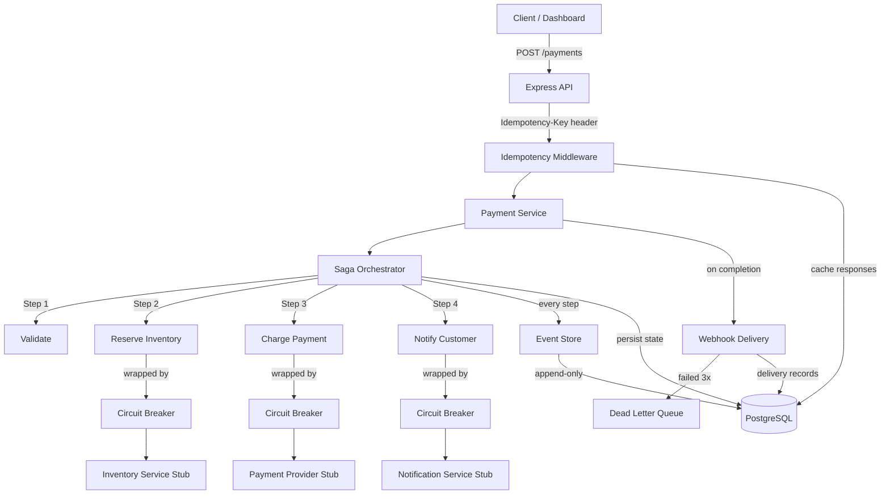

# Payment Orchestration System

A production-grade payment processing system that demonstrates distributed systems patterns: saga orchestration with compensation, event sourcing for audit trails, circuit breakers for resilience, idempotency for safe retries, and webhook delivery with dead-letter queues. Includes a Next.js dashboard for visual interaction.

## Quick Start

```bash
git clone <repo-url> && cd payment-orchestrator

# Start the API + PostgreSQL
docker-compose up --build -d

# Start the dashboard (in a separate terminal)
cd dashboard && npm install && npm run dev
```

- **API**: http://localhost:3000
- **Dashboard**: http://localhost:3001

Wait ~30 seconds for the health check to pass, then open the dashboard or use curl:

```bash
# Health check
curl http://localhost:3000/health

# Register a webhook
curl -X POST http://localhost:3000/webhooks/register \
  -H "Content-Type: application/json" \
  -d '{"url": "https://httpbin.org/post", "events": ["payment.completed", "payment.failed"]}'

# Create a payment (runs the full saga)
curl -X POST http://localhost:3000/payments \
  -H "Content-Type: application/json" \
  -H "Idempotency-Key: pay-001" \
  -d '{
    "amount": 5000,
    "currency": "USD",
    "customerId": "cust_123",
    "orderId": "ord_456",
    "items": [{"productId": "prod_1", "quantity": 2, "pricePerUnit": 2500}]
  }'

# Get payment state (derived from event replay)
curl http://localhost:3000/payments/<payment-id>

# Get full event history
curl http://localhost:3000/payments/<payment-id>/events

# Idempotent retry (returns cached response, no reprocessing)
curl -X POST http://localhost:3000/payments \
  -H "Content-Type: application/json" \
  -H "Idempotency-Key: pay-001" \
  -d '{
    "amount": 5000,
    "currency": "USD",
    "customerId": "cust_123",
    "orderId": "ord_456",
    "items": [{"productId": "prod_1", "quantity": 2, "pricePerUnit": 2500}]
  }'
```

Clean up:

```bash
docker-compose down -v
```

## Dashboard

The Next.js dashboard provides a visual interface to interact with and showcase the system.

| Page | What it shows |
|------|---------------|
| **Dashboard** (`/`) | System health, stats, pattern descriptions, quick payment buttons, recent payments |
| **New Payment** (`/payments/new`) | Full payment form with dynamic line items and calculated totals |
| **Payment Detail** (`/payments/:id`) | Saga flow visualization, event sourcing timeline with payload data |
| **Webhooks** (`/webhooks`) | Register callback URLs, select event types, view active registrations |

## Architecture



## Patterns Demonstrated

| Pattern | Description |
|---------|-------------|
| **Saga Orchestration** | Multi-step payment flow with automatic compensation on failure — each step defines execute() and compensate() |
| **Event Sourcing** | All payment state is derived by replaying an append-only event log, not from mutable columns |
| **Idempotency** | Idempotency-Key header ensures duplicate requests return cached responses without reprocessing |
| **Circuit Breaker** | Three-state (closed/open/half-open) protection around external services with exponential backoff and jitter |
| **Webhook Delivery** | HMAC-SHA256 signed webhooks with retry policy and dead-letter queue for permanently failed deliveries |
| **Result Type** | `Result<T, E>` union type replaces thrown exceptions in all business logic for explicit error handling |
| **Optimistic Locking** | Event store uses unique version constraints to prevent concurrent write conflicts |
| **RFC 7807** | All error responses follow the Problem Details standard |

## Why I Built This

Payment systems are where distributed systems patterns matter most — money can't be lost, duplicated, or stuck in limbo. This project demonstrates that I understand:

1. **Why sagas exist**: Distributed transactions across services (inventory, payments, notifications) can't use traditional ACID — saga compensation is the alternative.
2. **Why event sourcing**: When auditors or support engineers ask "what happened to this payment?", replaying events gives you the complete, immutable truth.
3. **Why idempotency**: Network retries, client timeouts, and load balancer replays mean your API *will* receive duplicate requests. Idempotency keys make this safe.
4. **Why circuit breakers**: When a downstream service degrades, you fail fast instead of cascading timeouts across your entire system.
5. **Why Result types**: Thrown exceptions are invisible in type signatures. `Result<T, E>` makes error paths explicit and forces callers to handle them.

## Tech Stack

- **Runtime**: Node.js 20+ with TypeScript (strict mode, ESM)
- **Database**: PostgreSQL 16 via Prisma ORM
- **API**: Express with RFC 7807 error responses
- **Dashboard**: Next.js 16 with Tailwind CSS
- **Testing**: Vitest (29 unit tests)
- **Infrastructure**: Docker + docker-compose (single command startup)

## API Endpoints

| Method | Path | Description |
|--------|------|-------------|
| `POST` | `/payments` | Start a payment saga (requires `Idempotency-Key` header) |
| `GET` | `/payments/:id` | Current state derived from event replay |
| `GET` | `/payments/:id/events` | Full event history (audit trail) |
| `POST` | `/webhooks/register` | Register a webhook callback URL |
| `GET` | `/health` | Database connectivity check |

## Project Structure

```
src/                          # Backend (Express + TypeScript)
  core/                       Result type, shared types, config, database
  events/                     Event store, payment projection (reducer)
  saga/                       Saga orchestrator, payment saga steps
  circuit-breaker/            Circuit breaker with exponential backoff
  idempotency/                Idempotency middleware
  webhooks/                   Webhook delivery, HMAC signing, DLQ
  external-services/          Stubbed payment, inventory, notification services
  api/                        Payment service, Express routes
  middleware/                 Error handler
  main.ts                    Application entry point

dashboard/                    # Frontend (Next.js + Tailwind)
  src/app/                    App Router pages
  src/components/             Shared UI components
  src/lib/                    API client

prisma/                       Schema and migrations
docs/                         Architecture diagrams and ADRs
```

## Running Tests

```bash
npm test          # Run all 29 unit tests
npx tsc --noEmit  # Type check
```
