# Payment Orchestration System

[](https://github.com/JamilAfouri99/payment-orchestrator/actions/workflows/ci.yml)

A production-grade payment processing system demonstrating distributed systems patterns at depth: multi-provider routing with scoring, saga orchestration with compensation, event sourcing with temporal queries, circuit breakers, bulkheads, fraud scoring, tokenization, multi-currency FX, GraphQL subscriptions, OpenTelemetry tracing, and chaos engineering. Includes a comprehensive Next.js dashboard for interactive demonstration.

## Screenshots

### Dashboard
Health status, circuit breakers (Stripe/Adyen/PayPal), bulkheads, quick payments, and recent payment history.

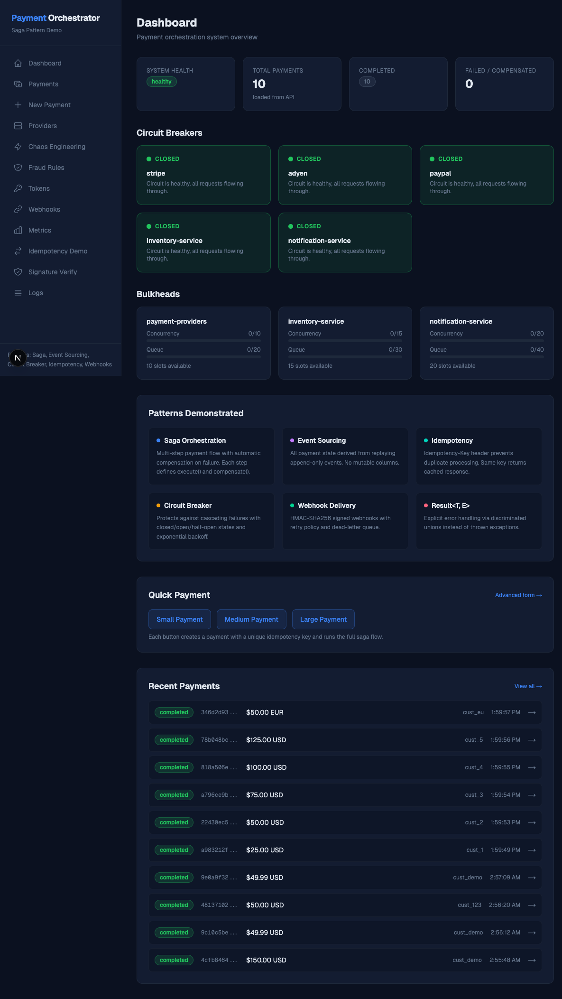

### Payments List
Paginated table with status badges, amounts, currencies (USD/EUR), and timestamps.

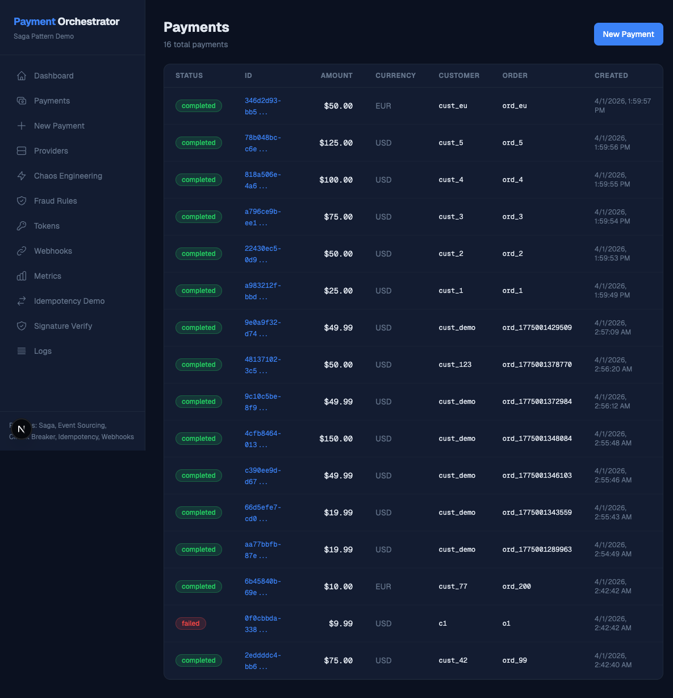

### Payment Detail
Saga flow visualization, event sourcing timeline with provider routing, fraud score gauge, and temporal queries.

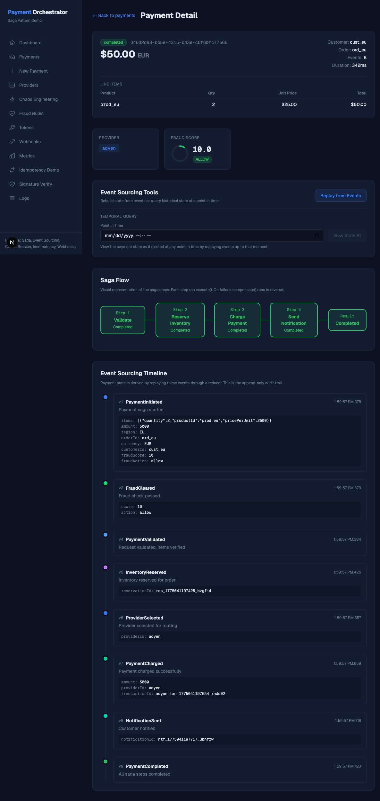

### Provider Performance
Per-provider cards (Stripe/Adyen/PayPal) with CB state, cost, currencies, regions, and routing simulator.

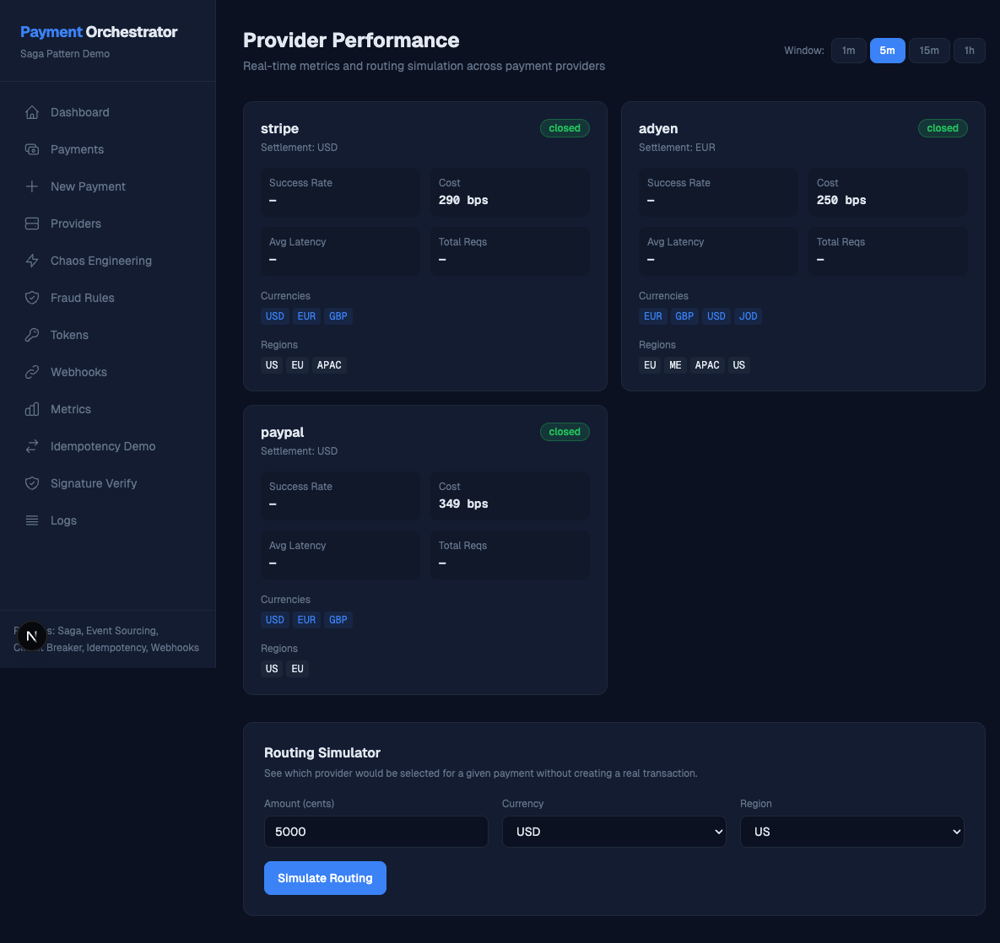

### Chaos Engineering
Runtime failure injection per provider/service with failure rate sliders, extra latency, and enable/disable toggles.

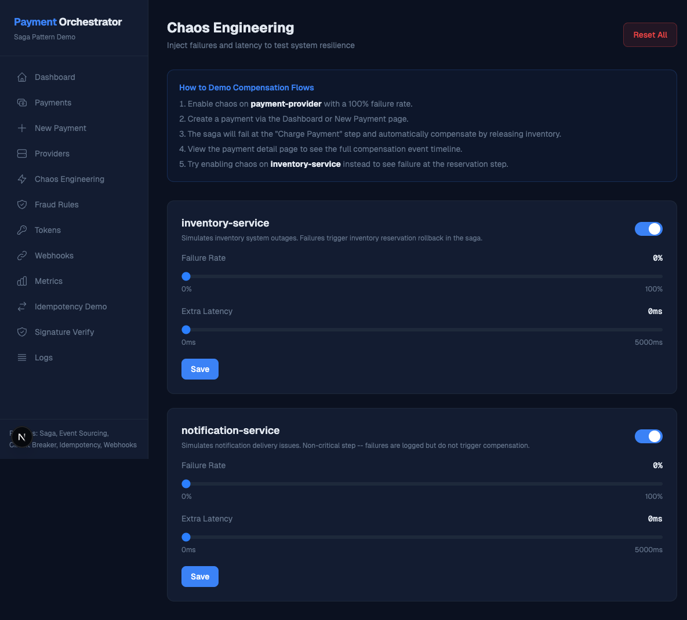

### Fraud Rules
5 configurable rules with weight sliders, enabled toggles, and fraud scoring simulator.

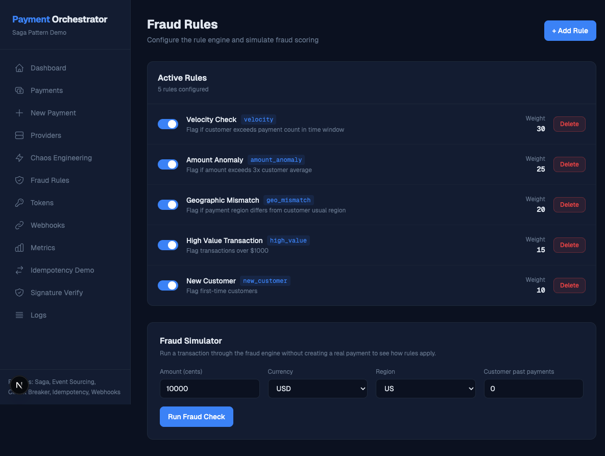

### Token Vault
Tokenized payment instruments with status tracking, usage count, and PCI DSS compliance info.

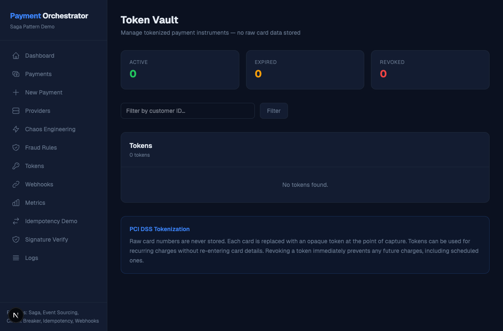

### Webhooks
Registration form, delivery history with status tracking, and dead-letter queue with retry.

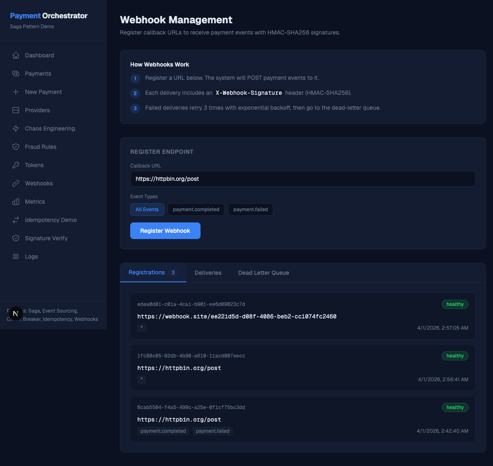

### Metrics
Request counters, payment stats, saga compensations, and latency histograms with percentiles.

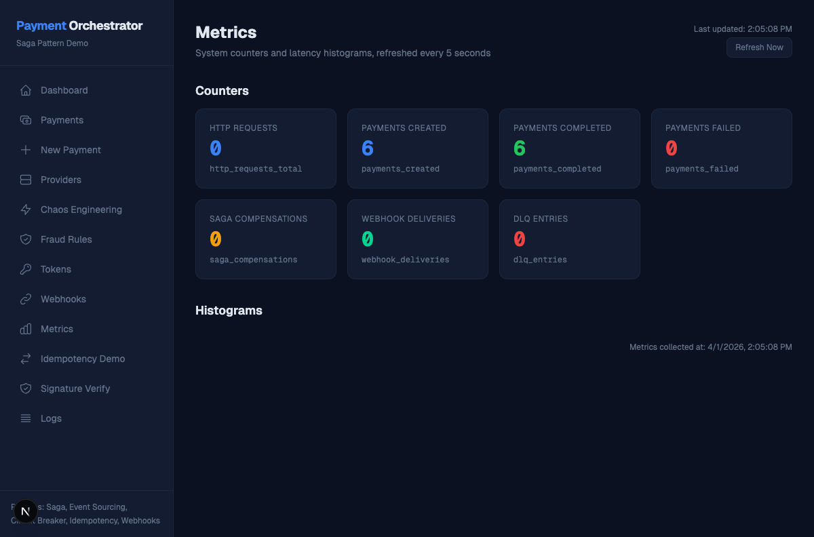

### Idempotency Demo
Send a payment then replay with the same key to prove no double-processing occurs.

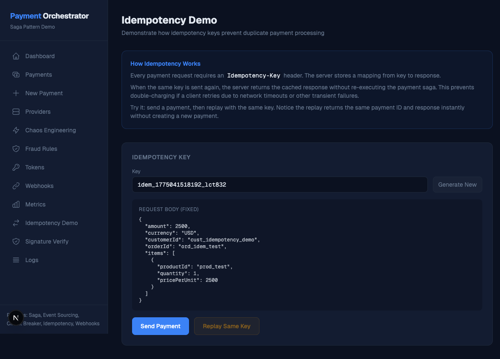

### Signature Verification
HMAC-SHA256 verification playground with step-by-step explanation of the signing process.

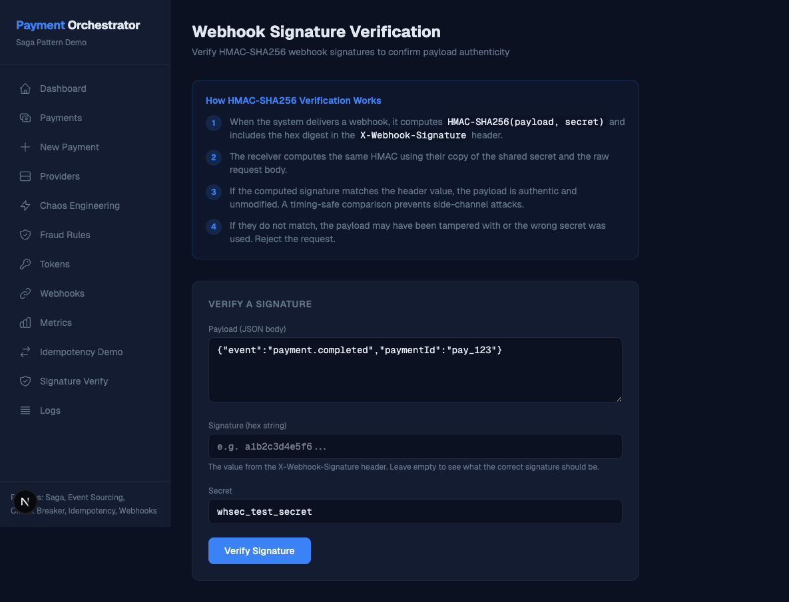

### System Logs
Live structured log stream with level filters, text search, and expandable JSON details.

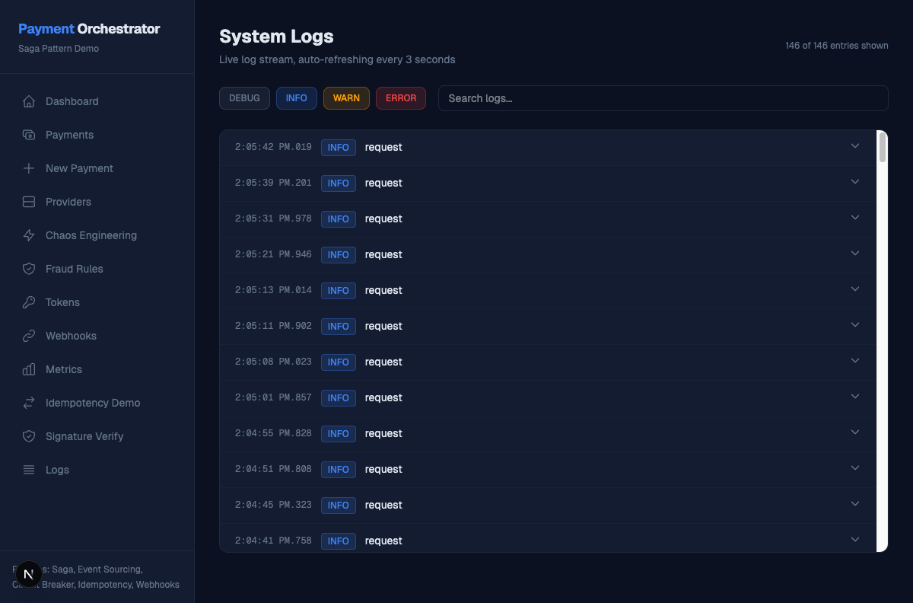

### Create Payment
Full payment form with dynamic line items, live total calculation, and automatic idempotency key generation.

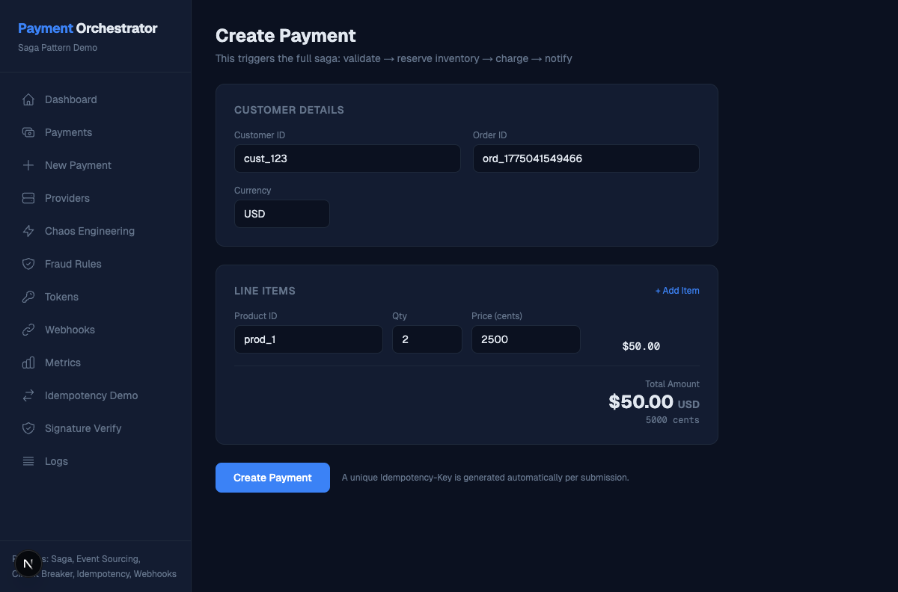

## Quick Start

```bash
git clone https://github.com/JamilAfouri99/payment-orchestrator.git
cd payment-orchestrator

# Start API + PostgreSQL + Jaeger
docker-compose up --build -d

# Start the dashboard (separate terminal)
cd dashboard && npm install && npm run dev
```

- **API**: http://localhost:3000
- **Dashboard**: http://localhost:3001
- **GraphQL Playground**: http://localhost:3000/graphql
- **Jaeger UI**: http://localhost:16686

## Architecture

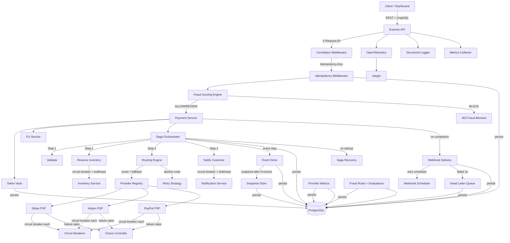

## Engineering Decisions

### Why Sagas Over 2PC

Two-phase commit requires all participants to be available simultaneously and hold locks. In a payment system with external providers (Stripe, Adyen, PayPal), this is impossible — each provider is an independent system with its own availability SLA. Saga orchestration with compensation handles partial failures gracefully: if Adyen charged but notification failed, the orchestrator knows exactly which steps to reverse and in what order. Saga state is persisted to PostgreSQL at every step, so even process crashes are recoverable.

### Why Event Sourcing Over CRUD

When a customer disputes a charge and asks "what happened to my payment?", a CRUD system can only show current state. Event sourcing gives the complete truth: every state transition, every provider attempt, every fraud check, with microsecond timestamps. Temporal queries let you reconstruct state at any past moment — invaluable for debugging and compliance. The tradeoff is query complexity, which snapshots and projections solve.

### Why Multi-Provider Routing with Scoring

Single-provider payment systems have a single point of failure. The routing engine scores providers by circuit breaker health (40%), historical success rate (30%), cost (20%), and region match (10%). When Stripe's circuit breaker opens, traffic automatically cascades to Adyen. This is how production payment systems at scale work — Shopify, Uber, and Amazon all use multi-acquirer routing. The scoring weights are configurable, not hardcoded.

### Why In-Process Circuit Breakers Over Service Mesh

A service mesh (Istio, Linkerd) adds infrastructure complexity that obscures the pattern. In-process circuit breakers with a registry pattern make the mechanism explicit, debuggable, and visible in the dashboard. Each provider has its own breaker with independent failure counts, exponential backoff with jitter (capped at 2^5), and manual reset via admin API. The registry enables centralized monitoring across all breakers.

### Why Fraud Scoring Runs Pre-Saga

Running fraud checks before the saga starts avoids wasting inventory reservations and provider capacity on payments that will be blocked. The scoring engine is rule-based with configurable weights, running velocity checks, amount anomaly detection, geographic mismatch analysis, and new customer flagging. Rules are stored in the database and editable through the dashboard — no code changes needed to adjust fraud sensitivity.

### Why Tokenization Before Event Store

Raw card numbers (PANs) must never appear in logs, events, or database columns outside a dedicated vault. The tokenization layer runs before any event is appended, so the `PaymentInitiated` event only contains the token ID and last 4 digits. The `card-masker` utility provides defense-in-depth by redacting sensitive keys from any object that passes through logging. This demonstrates PCI-DSS awareness without requiring actual HSM infrastructure.

### Why GraphQL Alongside REST

REST works well for simple CRUD, but payment systems need flexible querying (payments with filtering, nested event timelines), real-time updates (subscription for payment status changes), and reduced over-fetching (dashboard pages need different field combinations). GraphQL serves these needs. Using `graphql-yoga` keeps it lightweight — resolvers delegate to the same service layer as REST handlers, so there's no duplicated business logic.

## Patterns Demonstrated

| Pattern | Module | Notes |
|---------|--------|-------|
| **Multi-Provider Routing** | `src/routing/` | Weighted scoring engine with cascading fallback across 3 PSPs |
| **Decline Code Analysis** | `src/retry/` | Hard/soft/retriable classification with per-category retry strategy |
| **Fraud Scoring Engine** | `src/fraud/` | Rule-based pre-saga evaluation with DB-stored configurable rules |
| **Tokenization Vault** | `src/tokenization/` | PCI-compliant card tokenization with lifecycle management |
| **Multi-Currency FX** | `src/fx/` | Simulated FX rates with spread tracking and settlement conversion |
| **Saga Orchestration** | `src/saga/` | 4-step payment flow with automatic reverse-order compensation |
| **Event Sourcing** | `src/events/` | Append-only events, state via reducer replay, temporal queries |
| **Snapshot Optimization** | `src/events/` | After N events, snapshots avoid full history replay |
| **Circuit Breaker** | `src/circuit-breaker/` | Per-provider three-state protection with exponential backoff + jitter |
| **Bulkhead** | `src/bulkhead/` | Per-service concurrency isolation with queue overflow rejection |
| **Chaos Engineering** | `src/chaos/` | Runtime failure injection per service without restarts |
| **Idempotency** | `src/idempotency/` | Idempotency-Key header prevents duplicate processing |
| **Webhook Delivery** | `src/webhooks/` | HMAC-SHA256 signed with retry scheduler and dead-letter queue |
| **GraphQL API** | `src/graphql/` | Queries, mutations, subscriptions alongside REST |
| **OpenTelemetry** | `src/observability/` | Distributed tracing with Jaeger integration |
| **Structured Logging** | `src/core/logger.ts` | JSON logs with correlation IDs and in-memory buffer |
| **Result\<T, E\>** | `src/core/result.ts` | Discriminated union replaces thrown exceptions in business logic |
| **RFC 7807** | `src/middleware/` | All error responses follow Problem Details standard |
| **Registry Pattern** | `src/circuit-breaker/` | Centralized management and monitoring of all breakers |
| **Saga Recovery** | `src/saga/` | Startup scan detects and handles incomplete sagas from crashes |

## API Endpoints

### Public

| Method | Path | Description |
|--------|------|-------------|
| `GET` | `/health` | Database connectivity check |
| `GET` | `/payments` | List payments with pagination |
| `POST` | `/payments` | Start a payment saga (requires `Idempotency-Key`) |
| `GET` | `/payments/:id` | Current state derived from event replay |
| `GET` | `/payments/:id/events` | Full event history |
| `GET` | `/payments/:id/state?at=` | Temporal query: state at a point in time |
| `POST` | `/payments/:id/replay` | Rebuild state from events (bypasses snapshot) |
| `POST` | `/webhooks/register` | Register a callback URL |
| `GET` | `/webhooks/registrations` | List all webhook registrations |
| `GET` | `/webhooks/deliveries` | Delivery history with status |
| `GET` | `/webhooks/dlq` | Dead-letter queue contents |
| `POST` | `/webhooks/dlq/:id/retry` | Retry a DLQ entry |

### Admin

| Method | Path | Description |
|--------|------|-------------|
| `GET` | `/admin/providers` | All providers with config and CB state |
| `GET` | `/admin/providers/metrics` | Per-provider success rate, latency, volume |
| `GET` | `/admin/routing/simulate` | Simulate routing for given params |
| `GET/POST` | `/admin/chaos` | Read/update chaos configuration |
| `POST` | `/admin/chaos/reset` | Reset chaos to defaults |
| `GET` | `/admin/circuit-breakers` | State of all circuit breakers |
| `POST` | `/admin/circuit-breakers/:name/reset` | Reset a specific breaker |
| `GET/POST` | `/admin/fraud/rules` | CRUD for fraud rules |
| `GET` | `/payments/:id/fraud` | Fraud evaluation for a payment |
| `POST` | `/admin/fraud/simulate` | Simulate fraud scoring |
| `GET` | `/tokens` | List payment tokens |
| `POST` | `/tokens/revoke/:token` | Revoke a token |
| `GET/POST` | `/admin/fx/rates` | Read/update FX rates |
| `GET` | `/admin/decline-codes` | List all decline codes |
| `GET` | `/admin/metrics` | Counters and histograms |
| `GET` | `/admin/logs` | Recent structured log entries |
| `GET` | `/admin/bulkheads` | Bulkhead concurrency stats |
| `POST` | `/admin/saga-recovery` | Trigger saga recovery scan |
| `POST` | `/webhooks/verify` | HMAC-SHA256 verification |

### GraphQL

| Endpoint | Description |
|----------|-------------|
| `POST /graphql` | Queries, mutations, and subscriptions |
| `GET /graphql` | GraphiQL interactive playground |

## Tech Stack

- **Runtime**: Node.js 20+ with TypeScript (strict mode, ESM)
- **Database**: PostgreSQL 16 via Prisma ORM (12 models)
- **API**: Express with RFC 7807 errors + GraphQL via graphql-yoga
- **Tracing**: OpenTelemetry with Jaeger
- **Dashboard**: Next.js 16, Tailwind CSS v4, App Router
- **Testing**: Vitest (207 unit tests across 15 test files)
- **Infrastructure**: Docker Compose (PostgreSQL + App + Jaeger)
- **CI/CD**: GitHub Actions (lint, typecheck, test, Docker build)

## Project Structure

```
src/
  core/               Result type, types, config, database, logger, correlation
  events/             Event store, snapshot store, payment projection (reducer)
  saga/               Saga orchestrator, payment saga steps, startup recovery
  routing/            Provider registry, routing engine, provider metrics
  retry/              Decline codes, retry strategy
  fraud/              Fraud engine, rules, seed data
  tokenization/       Token vault, card masker (PCI compliance)
  fx/                 FX rate service, currency conversion
  circuit-breaker/    Circuit breaker, registry pattern
  bulkhead/           Concurrency limiter
  chaos/              Runtime failure injection controller
  metrics/            In-memory counters and histograms
  idempotency/        Idempotency middleware
  webhooks/           Webhook delivery, HMAC signing, DLQ, retry scheduler
  external-services/  Stripe, Adyen, PayPal PSP stubs + inventory + notification
  graphql/            Schema, resolvers, subscriptions, Yoga server
  observability/      OpenTelemetry tracing, span helpers
  api/                Payment service, routes, admin routes
  middleware/         Error handler, request logger
  main.ts             Application entry point

dashboard/
  src/app/            13 pages (App Router)
  src/components/     Shared UI components
  src/lib/            API client with 30+ fetch functions

prisma/               Schema (12 models) and migrations
.github/workflows/    CI pipeline
docs/                 Architecture diagrams, ADRs, implementation plan
```

## Running Tests

```bash
npm test              # 207 unit tests
npx tsc --noEmit      # Type check backend
cd dashboard && npx tsc --noEmit  # Type check frontend
```

## What I'd Do Differently in Production

1. **Message broker over polling** — Replace the 5s webhook scheduler with Kafka or NATS for event-driven delivery. The polling pattern works for demo but adds latency at scale.

2. **Real vault for tokenization** — HashiCorp Vault or AWS CloudHSM instead of DB-stored encrypted PANs. The simulated vault demonstrates the pattern but not the security boundary.

3. **Temporal/Cadence for sagas** — Hand-rolled saga orchestration works but lacks visibility, retry policies, and versioning that Temporal provides out of the box. The manual approach shows understanding of the underlying mechanics.

4. **Redis for idempotency** — PostgreSQL works for idempotency keys but Redis with TTL is faster and naturally expires entries. The current implementation requires manual cleanup.

5. **Separate read/write models** — Full CQRS with dedicated read projections would avoid the N+1 problem in `listPayments()` which replays events per payment. A materialized view or denormalized read table would be more efficient.

6. **Rate limiting at the gateway** — No API rate limiting exists. Production would use nginx or a dedicated gateway with per-client rate limits, not application-level logic.

7. **Observability depth** — The OpenTelemetry setup is basic. Production would add custom metrics exporters, SLO alerting, and distributed context propagation across actual microservices instead of in-process calls.

8. **Provider contract testing** — The PSP stubs simulate behavior but don't verify against real provider APIs. Pact or similar contract testing would catch integration drift.

## Demo Workflow

1. Open the dashboard at `http://localhost:3001`
2. Go to **Chaos Engineering** — set Stripe failure rate to 100%
3. Go to **Dashboard** — click "Small Payment" — watch it route through Adyen instead
4. Check **Payment Detail** — see the saga flow, provider routing, and event timeline
5. Go to **Fraud Rules** — lower the high-value threshold to $5, create a $10 payment — watch it get blocked
6. Go to **Providers** — see per-provider success rates and latency
7. Go to **Idempotency Demo** — send a payment, then replay with the same key
8. Go to **Webhooks** — register a URL, create a payment, check Deliveries tab
9. Open **GraphQL Playground** at `/graphql` — query payments with nested events
10. Open **Jaeger UI** at `http://localhost:16686` — view distributed traces
