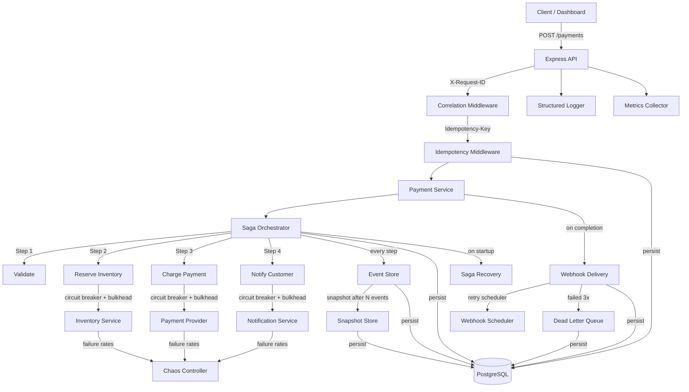
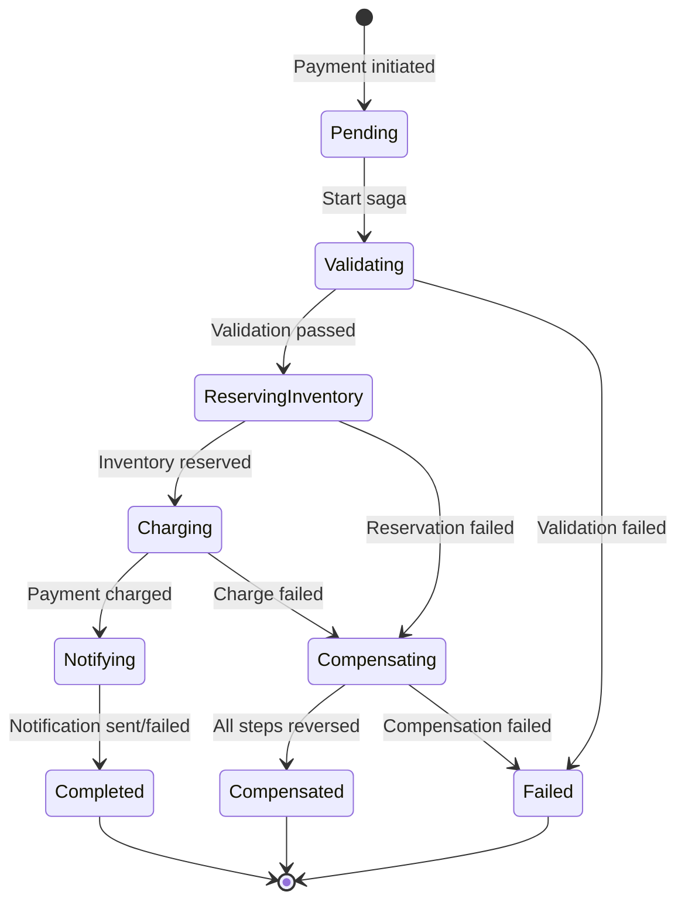
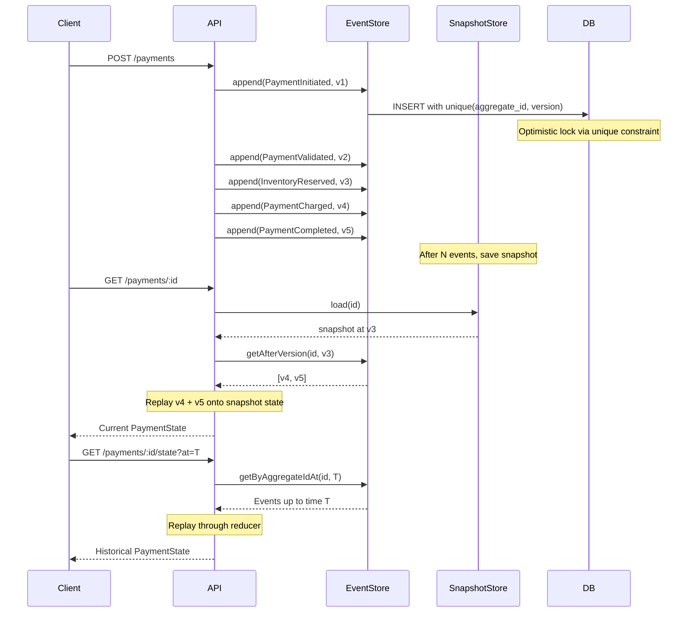
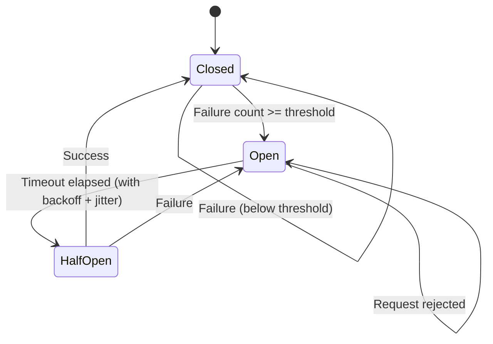
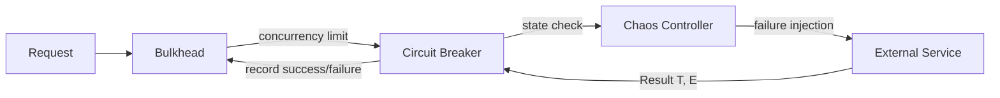
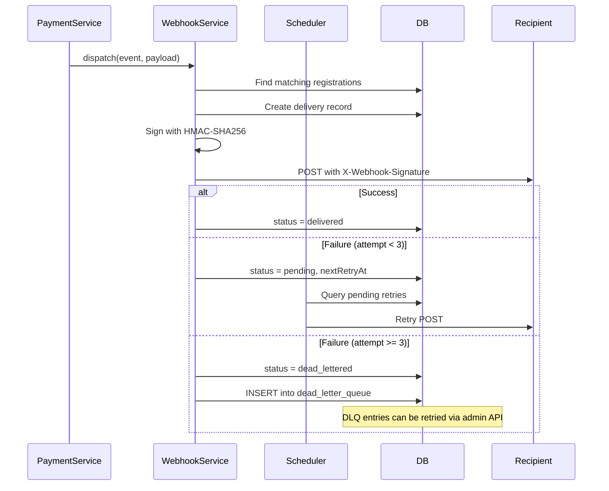
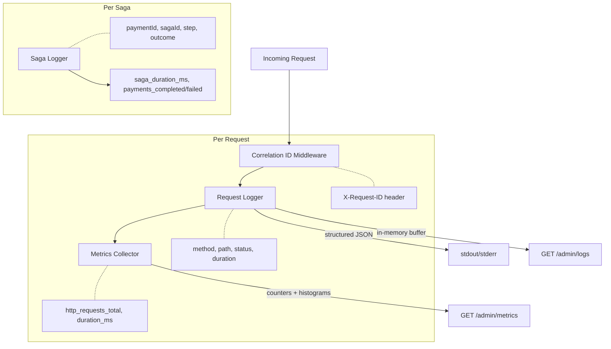

# Architecture

## System Overview

## Saga State Machine

Each step implements `execute()` and `compensate()`. On failure at step N, the orchestrator calls `compensate()` on steps N-1 through 0 in reverse order. Saga state is persisted to `saga_executions` before and after each step, enabling recovery after crashes.

## Event Sourcing Flow

## Circuit Breaker States

Each external service has its own circuit breaker instance, managed through a central registry. The admin API exposes breaker state and allows manual resets.

## Resilience Stack

Three layers of protection wrap every external service call:
1. **Bulkhead**: Limits concurrent requests to prevent resource exhaustion
2. **Circuit Breaker**: Fails fast when a service is degraded
3. **Chaos Controller**: Enables runtime failure injection for testing

## Webhook Delivery + Dead Letter Queue

## Observability Stack

