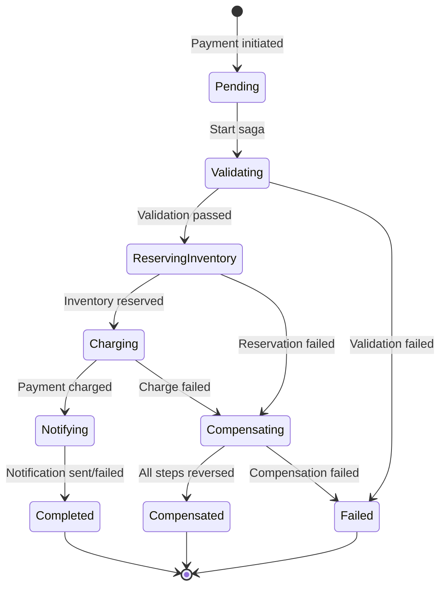
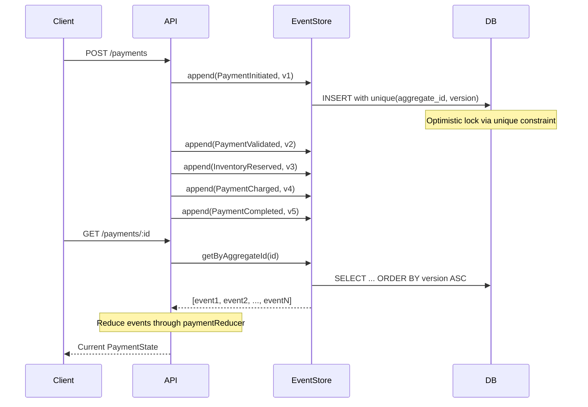
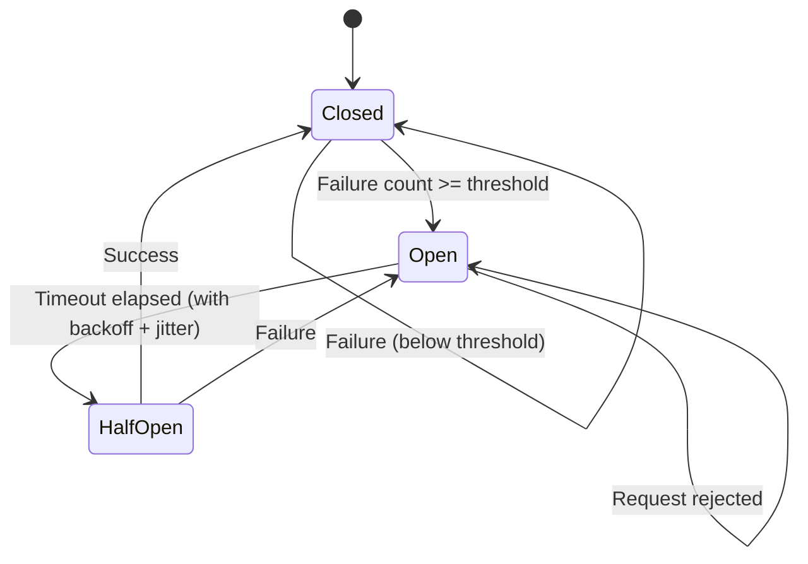
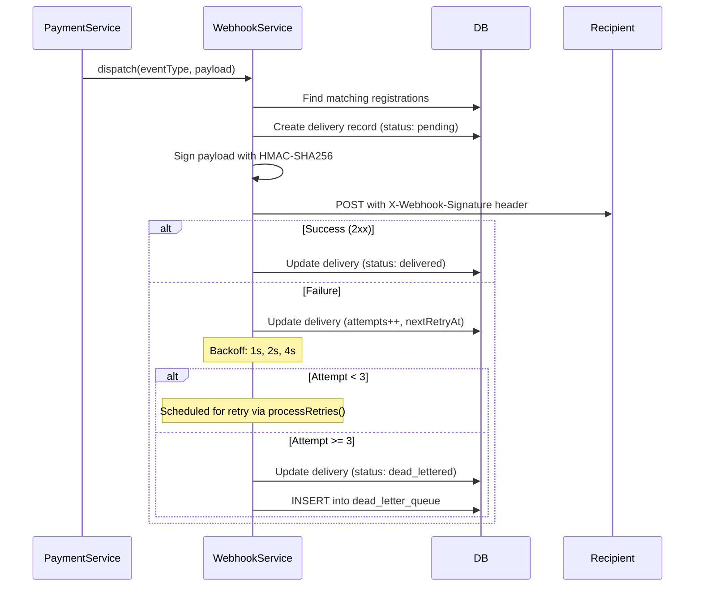

# Architecture

## Saga State Machine

Each step implements `execute()` and `compensate()`. On failure at step N, the orchestrator calls `compensate()` on steps N-1 through 0 in reverse order. Saga state is persisted to `saga_executions` before and after each step, so the process can be recovered after a crash.

## Event Sourcing Flow

Payment state is never stored as a mutable row. Instead, the current state is computed by replaying the event log through a pure reducer function (`fullPaymentReducer`). This provides:

- Complete audit trail of every state change
- Ability to replay and debug any payment issue
- Optimistic locking via the unique `(aggregate_id, version)` constraint

## Circuit Breaker States

Configuration:
- **Failure threshold**: Number of consecutive failures to open the circuit (default: 5)
- **Timeout**: Base time before attempting half-open (default: 30s)
- **Backoff**: Exponential with jitter, capped at 2^5 * base timeout

Each external service (payment provider, inventory, notifications) has its own circuit breaker instance.

## Webhook Delivery + Dead Letter Queue

Webhook signatures use HMAC-SHA256 with the configured secret. Recipients verify by computing `HMAC-SHA256(body, secret)` and comparing to the `X-Webhook-Signature` header.
